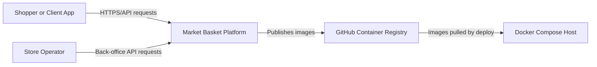
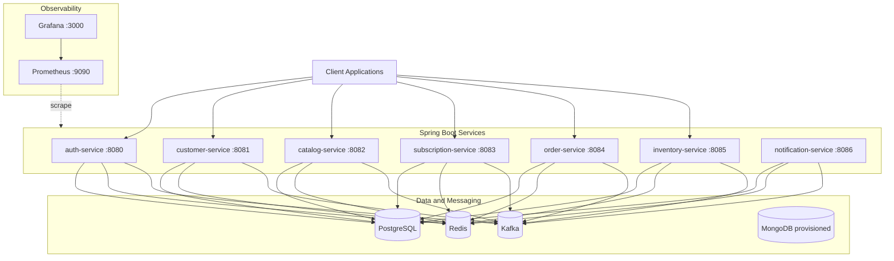
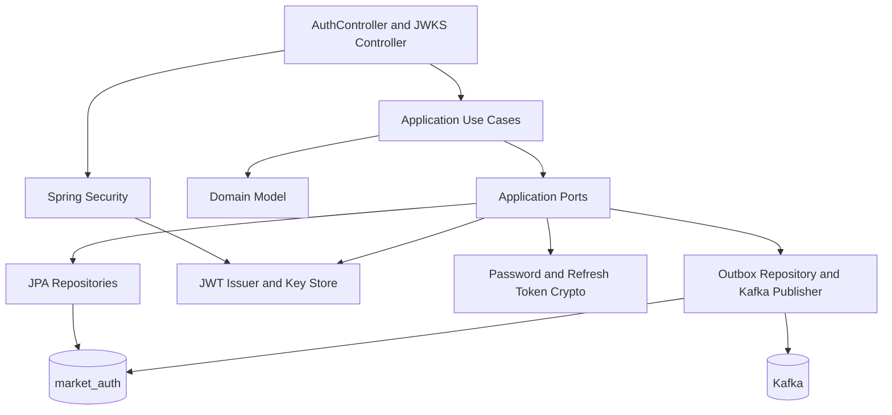
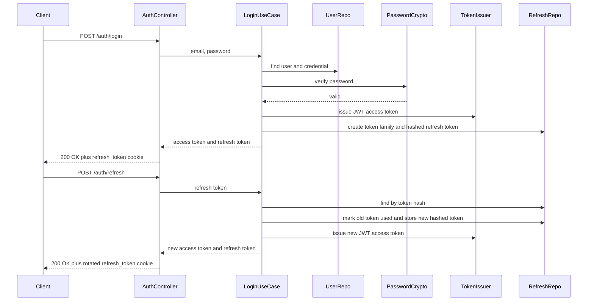
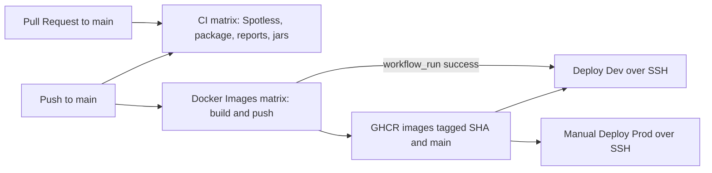
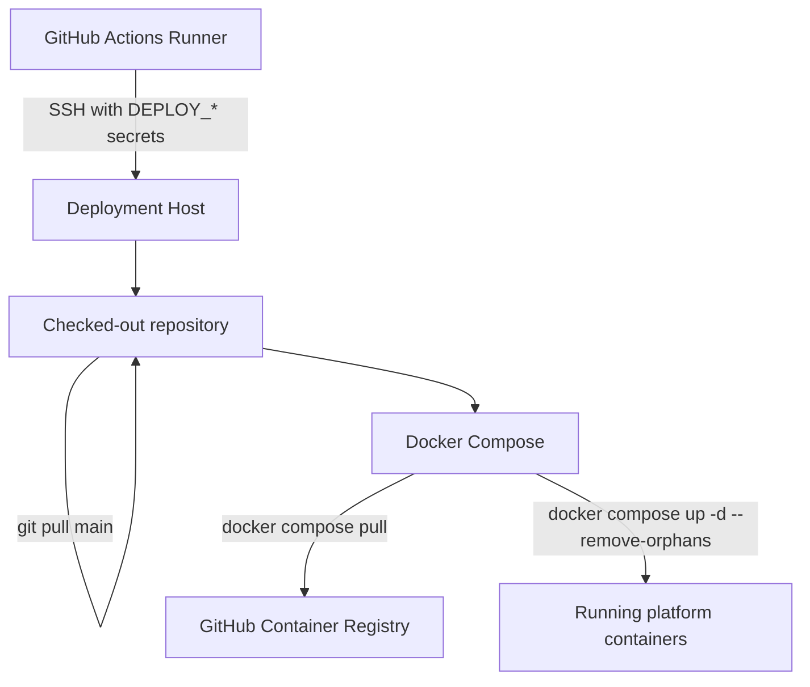

# Diagrams

These diagrams use Mermaid and render directly in GitHub.

## System Context

## Container View

## Auth Service Components

## Login And Refresh Flow

## CI/CD Flow

## Deployment Runtime

